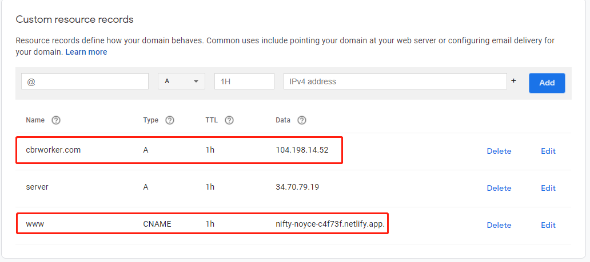

# Deployment: Deploy React and Spring Boot

# Deploy React

Use Netlify

```bash
npm run build
```

add this file to build folder

**_redirects**

```bash
/*    /index.html   200
```

zip the build folder

drop the build folder to Netlify


# Deploy Spring Boot with Docker

**System**: 

Ubuntu 20.04 LTS

**Platform**: 

Google Cloud VM (Compute Engine)

## Exact Command Steps

### Update first

```bash
sudo apt-get update
```

### To Install Git

```bash
sudo apt-get install git-all
```

### If the git repository is private, we need to add SSH key

### Generate SSH key

```bash
ssh-keygen -t rsa -b 2048 -C ["y](mailto:%22ycchou@sfu.ca)our_email@email.com"
```

(press enter for all subsequent steps)

### Get SSH public key

```bash
cat ~/.ssh/id_rsa.pub
```

(the public key will be printed up on screen)

### Add Key to Git Remote Server (GitHub or GitLab)

Go to Git remote server, then go to settings.

Click on add SSH key and add the public key we just got from the previous step

### Git clone the repository

Now we should be able to git clone the repository using the SSH URL

```bash
git clone ...
```

### Install JDK

I prefer OpenJDK

The JDK version should match the Spring Boot JDK version (e.g. JDK 11)

```bash
sudo apt-get install openjdk-11-jdk
```

Check if Java is installed properly

```bash
java -version
```

### Install maven

```bash
sudo apt-get install maven
```

### Install maven dependencies

On the root folder of the Spring Boot where pom.xml is located,

```bash
mvn install
```

If success, we should see

```bash
[INFO] ------------------------------------------------------------------------
[INFO] BUILD SUCCESS
[INFO] ------------------------------------------------------------------------
[INFO] Total time:  50.536 s
[INFO] Finished at: 2021-02-19T18:55:25Z
[INFO] ------------------------------------------------------------------------
```

### Build Spring Boot application

```bash
mvn clean package -DskipTests
```

We also need to build it again every time when there is new commit code

-DskipTests is to skip the tests because we do not have JUnit tests now. If we do not skip the tests, the build will fail.

If success, we should see

```bash
[INFO] ------------------------------------------------------------------------
[INFO] BUILD SUCCESS
[INFO] ------------------------------------------------------------------------
[INFO] Total time:  7.936 s
[INFO] Finished at: 2021-02-19T18:57:19Z
[INFO] ------------------------------------------------------------------------
```

### Install Docker

We need Docker to create a container for our Spring Boot application

**Referece**:

[https://docs.docker.com/engine/install/ubuntu/](https://docs.docker.com/engine/install/ubuntu/)

### Set up the Docker repository

```bash
sudo apt-get install \
    apt-transport-https \
    ca-certificates \
    curl \
    gnupg-agent \
    software-properties-common
```

```bash
curl -fsSL https://download.docker.com/linux/ubuntu/gpg | sudo apt-key add -
```

```bash
sudo apt-key fingerprint 0EBFCD88
```

```bash
sudo add-apt-repository \
   "deb [arch=amd64] https://download.docker.com/linux/ubuntu \
   $(lsb_release -cs) \
   stable"
```

### Install Docker Engine

```bash
sudo apt-get install docker-ce docker-ce-cli containerd.io
```

### Test if Docker is installed

```bash
sudo docker run hello-world
```

If success, we should see:

```bash
Hello from Docker!
This message shows that your installation appears to be working correctly.
```

### Install docker-compose

**Reference**:

[https://docs.docker.com/compose/install/](https://docs.docker.com/compose/install/)

```bash
sudo curl -L "https://github.com/docker/compose/releases/download/1.28.4/docker-compose-$(uname -s)-$(uname -m)" -o /usr/local/bin/docker-compose
```

```bash
sudo chmod +x /usr/local/bin/docker-compose
```

Test installation:

```bash
docker-compose --version
```

### Create Dockerfile and docker-compose.yml

We need to create the following files at the root folder of Spring Boot application.

**docker-compose.yml**

```yaml
version: "3.2"
services:
  app:
    build: .
    ports:
      - 8080:8080
    networks:
      - backend

networks:
  backend:
```

**Dockerfile**

```
FROM openjdk:11
VOLUME ["/tmp"]
ADD /target/{this is the output jar file name}.jar app.jar
RUN sh -c 'touch /app.jar'
EXPOSE 8080
ENTRYPOINT ["java","-Djava.security.egd=file:/dev/./urandom","-jar","app.jar"]
```

### Build Docker container

At the root folder of Spring Boot, run this command to build a docker container

```bash
sudo docker-compose up --build -d
```

List docker container to see if it is built successfully

```bash
sudo docker container ls
```

If success, we should see the container with our Spring Boot application name is running

### Install Nginx and use it to request HTTPS certificate

This GitHub repository is a good tool to set up Nginx and request Let's Encrypt made by Alex Senhung Wong ([https://github.com/wsenh/nginx-certbot](https://github.com/wsenh/nginx-certbot))

I forked a version here just to keep a copy

[https://github.com/de2008de/nginx-certbot](https://github.com/de2008de/nginx-certbot)

Go back to the home directory

```bash
cd ~
```

Clone the CertBot repo and cd

```bash
git clone https://github.com/senhungwong/nginx-certbot.git && cd nginx-certbot
```

Generate dpparam

```bash
touch $(pwd)/dhparam/dhparam-2048.pem
```

```bash
sudo docker run -it --rm -v $(pwd)/dhparam:/data frapsoft/openssl dhparam -out /data/dhparam-2048.pem 2048
# Or if openssl is installed:
# openssl dhparam -out $(pwd)/dhparam/dhparam-2048.pem 2048
```

Create temporary Nginx server

```bash
mkdir $(pwd)/sites
cp -f $(pwd)/templates/temporary.conf $(pwd)/temp/default.conf
cp $(pwd)/templates/index.html $(pwd)/sites/index.html
```

Change the server name [0x3fc.com](http://0x3fc.com/) to the desired domain in **./temp/default.conf**

```
server {
    listen       80;
    listen       [::]:80;
    server_name  0x3fc.com;   <---- Change this to our domain, cannot be IP
    location ~ /.well-known/acme-challenge {
        allow all;
        root /usr/share/nginx/html;
    }
    root /usr/share/nginx/html;
    index index.html;
}
```

Use any editor to edit the file (I prefer vim)

install vim

```bash
sudo apt-get install vim
```

**After changing server_name in default.conf, run the following command:**

Remember to cd to the parent folder of temp

```bash
sudo docker run -it --name temp-nginx -p 80:80 -p 443:443 \
    -v $(pwd)/temp/default.conf:/etc/nginx/conf.d/default.conf \
    -v $(pwd)/dhparam/dhparam-2048.pem:/etc/ssl/certs/dhparam-2048.pem \
    -v $(pwd)/sites:/usr/share/nginx/html \
    -d nginx:alpine
```

**Possible error: Port 8 is already in use:**

Port 80 is already in use.

In our example, Ubuntu Apche2 is currently using port 80.

```bash
sudo apt-get install lsof
```

```bash
sudo lsof -i tcp:80
```

We can see that apache2 is currently using port 80.

To stop apache2:

```bash
sudo systemctl stop apache2
```

**Possible error: not a directory:**

... not a directory: unknown: Are you trying to mount a directory onto a file (or vice-versa)? Check if the specified host path exists and is the expected type.

**Solution:**

Make sure that we are at the right location to run this command

We want to cd to the parent folder of temp (nginx-certbot folder) to run this command because

```bash
$(pwd)/temp/...
```

Generate certificate using CertBot

**Remember to replace the server name and email**

Make sure the domain is pointing to our VM IP (see the below Set up domain DNS section)

```bash
sudo docker run -it --rm \
    -v $(pwd)/certbot/etc/letsencrypt:/etc/letsencrypt \
    -v $(pwd)/certbot/var/lib/letsencrypt:/var/lib/letsencrypt \
    -v $(pwd)/sites:/data/letsencrypt \
    -v $(pwd)/certbot/var/log/letsencrypt:/var/log/letsencrypt \
    certbot/certbot \
    certonly --webroot \
    --email {email} --agree-tos --no-eff-email \
    --webroot-path=/data/letsencrypt \
    -d {server_name}
```

If success, we should see:

```
IMPORTANT NOTES:
 - Congratulations! Your certificate and chain have been saved at:
   /etc/letsencrypt/live/server.cbrworker.com/fullchain.pem
   Your key file has been saved at:
   /etc/letsencrypt/live/server.cbrworker.com/privkey.pem
   Your certificate will expire on 2021-05-20. To obtain a new or
   tweaked version of this certificate in the future, simply run
   certbot again. To non-interactively renew *all* of your
   certificates, run "certbot renew"
 - If you like Certbot, please consider supporting our work by:
   Donating to ISRG / Let's Encrypt:   https://letsencrypt.org/donate
   Donating to EFF:                    https://eff.org/donate-le
```

Remove temporary Nginx server

```bash
sudo docker rm temp-nginx -f
```

Create the SSL Nginx server

**Make sure we are at the nginx-certbot folder**

```bash
mkdir $(pwd)/nginx
mkdir $(pwd)/sites
cp -r $(pwd)/templates/conf.d $(pwd)/nginx
cp $(pwd)/templates/nginx.conf $(pwd)/nginx/nginx.conf
cp $(pwd)/templates/index.html $(pwd)/sites/index.html
```

Change the server name [0x3fc.com](http://0x3fc.com/) to the desired domains in ./nginx/conf.d/default.conf

```bash
server {
    listen       80;
    listen       [::]:80;
    server_name  [0x3fc.com](http://0x3fc.com/); <--- change this
    location / {
        rewrite ^ https://$host$request_uri? permanent;
    }
    location ~ /.well-known/acme-challenge {
        allow all;
        root /data/letsencrypt;
    }
}
server {
    listen          443         ssl http2;
    listen          [::]:443    ssl http2;
    server_name     [0x3fc.com](http://0x3fc.com/); <--- change this
    ssl on;
    server_tokens   off;
    ssl_buffer_size 8k;
    ssl_dhparam /etc/ssl/certs/dhparam-2048.pem;
    ssl_protocols               TLSv1.3 TLSv1.2 TLSv1.1;
    ssl_prefer_server_ciphers   on;
    ssl_ciphers                 ECDH+AESGCM:ECDH+AES256:ECDH+AES128:DH+3DES:!ADH:!AECDH:!MD5;
    ssl_ecdh_curve      secp384r1;
    ssl_session_tickets off;
    ssl_stapling on;
    ssl_stapling_verify on;
    resolver 8.8.8.8 8.8.4.4;
    ssl_certificate     /etc/letsencrypt/live/0x3fc.com/fullchain.pem; <-- change here
    ssl_certificate_key /etc/letsencrypt/live/0x3fc.com/privkey.pem; <-- change here
```

Run the SSL Nginx server

remember to go back to the nginx-certbot folder

```bash
sudo docker run -it --name nginx -p 80:80 -p 443:443 --restart=always \
    -v $(pwd)/nginx/conf.d:/etc/nginx/conf.d \
    -v $(pwd)/nginx/nginx.conf:/etc/nginx/nginx.conf \
    -v $(pwd)/dhparam/dhparam-2048.pem:/etc/ssl/certs/dhparam-2048.pem \
    -v $(pwd)/sites:/usr/share/nginx/html \
    -v $(pwd)/certbot/etc/letsencrypt:/etc/letsencrypt \
    -d nginx:alpine
```

### Renew Let's Encrypt

Let's Encrypt certificate will **expire in 90 days**. Therefore, we need to renew it.

Under the nginx-certbot folder, we can find a folder called scripts.

We want to run this command:

```
./scripts/renew.sh
```

Note that we need to run this command at one level up to the scripts folder. Otherwise, we will have path not found errors.

After running the renew.sh script, the certificate should be renewed.

### Configure Nginx network and forward rules

Now we have SSL Nginx server running. We need to add connect Nginx server container and the Spring Boot application container in the same network.

```bash
sudo docker network connect {network_id} {container_id(nginx)}
```

Note that from our docker-compose.yml file, we define the Spring Boot container network to be **backend**.

After connecting the network, we need to restart the Nginx container:

```bash
sudo docker container restart {nginx_container_id}
```

Run this command to get network ID:

```bash
sudo docker network ls
```

The network name with backend as suffix is the network we want. Copy its id.

Now we need to set up the forward rules at /nginx/conf.d/default.conf.

```bash
server {
    listen          443         ssl http2;
    listen          [::]:443    ssl http2;
    server_name     {your server name};
	...
    location / {
        add_header Strict-Transport-Security "max-age=31536000; includeSubDomains; preload";
        add_header X-XSS-Protection "1; mode=block" always;
        add_header X-Content-Type-Options "nosniff" always;
        add_header X-Frame-Options "DENY" always;
        add_header Referrer-Policy "strict-origin-when-cross-origin" always;
        proxy_pass http://app:8080;  <--- add this
	}
}
```

Note that we use **app** as the name here, because this is the container name we defined in docker-compose.yml file for the Spring Boot application.

## Set up domain DNS for Spring Boot VM

Before we send challenge request to Let's Encrypt, we need to make our domain point to the VM's IP address.

Set a server subdomain for our VM's IP


## Set up domain DNS for front-end Netlify

Go to Netlify and choose add custom domain.

We need to set up some DNS rules by following this configuration:


After setting up, it should look like this:



## To solve the issue which Spring Boot cannot connect to database

If Spring Boot is in a container, but the database is in the hosting machine, then we need to connect the Spring Boot container to the host network (the network with the hosting machine).

Add extra hosts to the docker-compose.yml file:

```bash
version: "3.2"
services:
  app:
    build: .
    ports:
      - 8080:8080
    networks:
      - backend
    extra_hosts:
      - "host.docker.internal:host-gateway"
networks:
  backend:
```

Then, in the application.properties, use host.docker.internal as the url for the hosting machine network. For example,

```bash
spring.datasource.url=jdbc:mysql://host.docker.internal:3306/cbr_data
spring.datasource.username=cbr
spring.datasource.password=@dm1n.CBR
spring.datasource.hikari.connection-test-query=SELECT 1
spring.datasource.hikari.minimum-idle=1
```
